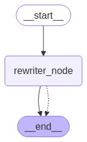
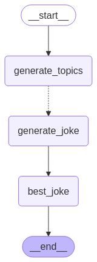
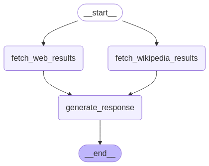
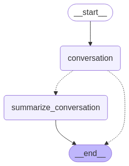

# LangGraph Study Notes

**LangGraph** is a framework designed for building **agent-based** and **multi-agent** applications. Unlike traditional sequential workflows, LangGraph introduces a **graph-based architecture**, enabling greater control over the flow of logic, enhanced parallel processing, and improved interpretability of AI-driven workflows.


---

## **1. Chat Models**
LangGraph integrates with **LLMs (Large Language Models)** through **Chat Models**. A Chat Model represents a structured interface between a model and the graph-based system.

### **Core Parameters**
- **Model Name** (`model`) → Specifies the underlying LLM (e.g., `gpt-4`, `claude-2`).
- **Temperature (`T`)** → Controls LLM output randomness:
  - `T = 0` → Deterministic and fact-driven responses.
  - `T = 1` → Highly creative and variable responses.
- **System Role** → Establishes context and behavior for the model.
- **Streaming Capabilities** → Supports real-time output streaming for interactive applications.

Chat Models serve as **nodes in the computation graph**, processing input messages and generating structured responses.

---

## **2. Message State Management**
LangGraph introduces **stateful message tracking**, ensuring continuity in conversations and AI agent interactions.

### **Structure of a Message**
Each message is structured as:
```json
{
  "role": "user",
  "content": "What is the capital of France?",
  "response_metadata": {}
}
```
- **`role`** → Specifies message origin (`"user"`, `"assistant"`, `"system"`, `"tool"`).
- **`content`** → The actual text or multimodal input.
- **`response_metadata`** → Logs additional data (e.g., token usage, log probabilities).

Messages are stored in **Message State**, a mutable structure that dynamically updates as the agent interacts with the environment.

---

## **3. Graph Representation**
A **graph-based workflow** forms the foundation of LangGraph. It enables complex logic execution by defining nodes (operations) and edges (data flow).

A **graph** in LangGraph consists of:
- **Nodes** $N = n_1, n_2, ..., n_k$ → Represent **computational units** (functions, models, or decision points).
- **Edges** $E =(n_i, n_j)$ → Define **execution order** and dependencies between nodes.

A simple LangGraph workflow may look like:
```python
graph = Graph()
graph.add_node("process_input", process_input_fn)
graph.add_node("llm", chat_model_fn)
graph.add_edge("process_input", "llm")
```
This structure allows **conditional routing, parallel execution, and adaptive workflows**.

---

## **4. Agents**
An **Agent** in LangGraph is an entity that interacts with the system by executing a sequence of actions, deciding on tool usage, and dynamically adjusting its state.

### **Agent Components**
- **Memory State** → Retains past interactions.
- **Decision Policy** → Determines the next best action.
- **Tool Invocation** → Calls external tools or functions.

Agents operate within a graph, allowing flexibility in AI-driven applications, such as task automation and intelligent decision-making.

---

## **5. Tool Nodes**
LangGraph enables the use of **Tool Nodes**, which represent external function calls that augment model capabilities.

### **Defining a Tool Node**
```python
def search_tool(query: str) -> str:
    return f"Searching for {query}..."

tool_node = ToolNode("search", search_tool)
```
Tool Nodes integrate with agents, allowing them to **execute API calls, database queries, or computations dynamically**.

---

## **6. Reducers**
A **Reducer** aggregates multiple outputs into a single consolidated result. This is useful in **multi-step, multi-agent, or parallel workflows**.

### **Common Reducers**
- **Concatenation Reducer** → Merges outputs into a single string.
- **Scoring Reducer** → Ranks and selects the best response.
- **Summarization Reducer** → Generates a concise summary from multiple results.

Example:
```python
def reduce_responses(responses: List[str]) -> str:
    return "\n".join(responses)
```
Reducers enhance data flow efficiency, ensuring coherent and relevant outputs in LangGraph applications.

---

## **7. Input-Output Schema**
To ensure consistency and structured data processing, LangGraph enforces **Input-Output Schemas**.

### **Schema Definition**
```python
from typing import TypedDict

class InputSchema(TypedDict):
    user_query: str
    context: Optional[str]

class OutputSchema(TypedDict):
    response: str
```
Schemas ensure that **each node receives and outputs data in a well-defined format**, making debugging and scaling much easier.

## Recipes

## 1. [Simple Arithmetic Agent](./recipes/basic_agent.py)



This script implements an **arithmetic assistant** using **LangChain**, **OpenAI’s ChatGPT**, and a **computation graph**. The assistant can perform arithmetic operations—addition, multiplication, and division—by integrating them as callable tools within an **LLM** agent.

Given two numbers $a, b \in \mathbb{R}$, the assistant supports the following operations: addition, multiplication and division.

These functions are then bound to an **LLM-powered agent** that can process user queries and execute the correct arithmetic operation.


```python
def add(a: float, b: float) -> float:
  """Add two numbers."""
    return a + b

def multiply(a: float, b: float) -> float:
  """Multiply two numbers."""
    return a * b

def divide(a: float, b: float) -> float:
  """Divide two numbers."""
    return "Error: Division by zero" if b == 0 else a / b

tools = [add, multiply, divide]
llm = ChatOpenAI(model="gpt-3.5-turbo")
llm_with_tools = llm.bind_tools(tools)

sys_msg = SystemMessage(content="You are a helpful assistant tasked with performing arithmetic.")

def assistant(state: MessagesState):
    return {"messages": [llm_with_tools.invoke([sys_msg] + state["messages"])]}

builder = StateGraph(MessagesState)
builder.add_node("assistant", assistant)
builder.add_node("tools", ToolNode(tools))
builder.add_edge(START, "assistant")
builder.add_conditional_edges("assistant", tools_condition)
builder.add_edge("tools", "assistant")

graph = builder.compile()

def main():
    print("\n🪮 Arithmetic Assistant 🪮\n")
    print("Computing: 25 * 30 / 24")
    
    user_input = "25 * 30 / 24"
    messages = [HumanMessage(content=user_input)]
    state = {"messages": messages}

    result = graph.invoke(state)
    final_message = result["messages"][-1]
    print("Result:", final_message.content)

    save_graph(graph, "./images/basic_agent.png")

if __name__ == "__main__":
    main()
```

The assistant is implemented using a **computation graph** that models the processing flow:

| Step | Description |
|------|------------|
| **Define operations** | Arithmetic functions 
| **Bind to LLM** | Attach functions to a LangChain-powered agent |
| **Graph construction** | Define nodes and edges for function execution |
| **Interactive execution** | Process user input and compute results |

This shows a structured way to integrate **arithmetic operations** into an **LLM agent** using a **computation graph**. 

```math
\text{Final Result} = \left( 25 \times 30 \right) / 24 = 31.25
```

Other tools and functions can be integrated into the graph, enabling the creation of more complex workflows. The LLM will call the functions (tool nodes) at is own digression based on their arguments and docstrings. 

## 2. [Few Shot Learning (Minimal)](./recipes/few_shot_learning.py)


This script defines a single node `rewriter_node` that demonstrates how to
provide multiple few-shot examples for polite rewrites in an LLM prompt.


Given an input sentence $s$, the assistant maps it to a rewritten form $s'$ that maintains the original meaning but enhances politeness. 

- The function $f$ is learned using few-shot examples, where each example provides a mapping from an impolite to a polite sentence.

```python
model = ChatOpenAI(model="gpt-3.5-turbo", temperature=0.2)

def rewriter_node(state: MessagesState) -> Command[Literal["__end__"]]:
    """
    A node that uses few-shot examples to guide the LLM in producing
    polite rewrites of user-provided sentences.
    """

    few_shot_examples = [
        """Example 1:
User: "Rewrite this sentence more politely: 'Give me water now!'"
Assistant: "Could you please give me some water?\"""",
        """Example 2:
User: "Rewrite this sentence more politely: 'Move over.'"
Assistant: "Could you please move over?\"""",
        """Example 3:
User: "Rewrite this sentence more politely: 'Stop talking.'"
Assistant: "Could you please stop talking?\"""",
        """Example 4:
User: "Rewrite this sentence more politely: 'Clean this mess up!'"
Assistant: "Could you please help clean up this mess?\"""",
    ]

    # Combine examples into one system prompt
    few_shot_prompt = (
        "You are a helpful rewriting assistant. "
        "Below are examples of rewriting sentences into a more polite form.\n\n"
        + "\n\n".join(few_shot_examples)
    )

    # The final message list
    messages = [
        {"role": "system", "content": few_shot_prompt},
        *state["messages"],
    ]

    # Invoke the LLM
    ai_response = model.invoke(messages)

    # Return the final AI message
    return {"messages": [ai_response]}

# Build the minimal LangGraph pipeline
builder = StateGraph(MessagesState)
builder.add_node("rewriter_node", rewriter_node)
builder.set_entry_point("rewriter_node")
builder.add_edge("rewriter_node", END)

graph = builder.compile()


def main():
    user_input = "Give me the bottle of water immediately!"
    print("\n--- Polite Rewriter ---\n")
    print(f"Original input: \"{user_input}\"\n")
    
    result = graph.invoke({"messages": [("user", user_input)]})
    
    if "messages" in result and result["messages"]:
        final_message = result["messages"][-1]
        print(f"Polite version: \"{final_message.content}\"")
    else:
        print("No response generated.")
    
    print("\nDone.")

    save_graph(graph, "./images/few_shot_learning.png")

if __name__ == "__main__":
    main()

```

By using structured examples, the model learns to map according to the examples provided. This script demonstrates how to use **few-shot learning** to guide an LLM in generating certain types of responses.

## 3. [Map-Reduce Joke Generator](./recipes/map_reduce.py)



This script implements a **map-reduce** pipeline using **LangGraph** and **GPT-4o** to generate jokes based on a given topic. The process follows these steps:

1. Generate **sub-topics** related to the given topic.
2. Generate a **joke** for each sub-topic.
3. Select the **best joke** from the generated set.

## Pipeline


| Step | Description |
|------|------------|
| **Generate Topics** | Create 3 sub-topics related to the main topic. |
| **Generate Jokes** | Generate a joke for each sub-topic. |
| **Select Best Joke** | Choose the best joke from the generated list. |


```python
subjects_prompt = """Generate a list of 3 sub-topics related to {topic}."""
joke_prompt = """Generate a joke about {subject}"""
best_joke_prompt = """Select the best joke from:

{jokes}"""

# LLM
model = ChatOpenAI(model="gpt-4o", temperature=0)

# Define states
class Subjects(BaseModel):
    subjects: list[str]

class BestJoke(BaseModel):
    id: int
    
class OverallState(TypedDict):
    topic: str
    subjects: list
    jokes: Annotated[list, operator.add]
    best_selected_joke: str

def generate_topics(state: OverallState)-> Subjects:
    prompt = subjects_prompt.format(topic=state["topic"])
    response = model.with_structured_output(Subjects).invoke(prompt)
    return {"subjects": response.subjects}

def generate_joke(state: TypedDict):
    prompt = joke_prompt.format(subject=state["subject"])
    response = model.with_structured_output(Joke).invoke(prompt)
    return {"jokes": [response.joke]}

def best_joke(state: OverallState):
    prompt = best_joke_prompt.format(topic=state["topic"], jokes="\n\n".join(state["jokes"]))
    response = model.with_structured_output(BestJoke).invoke(prompt)
    return {"best_selected_joke": state["jokes"][response.id]}

def continue_to_jokes(state: OverallState):
    return [Send("generate_joke", {"subject": s}) for s in state["subjects"]]

# Build Graph
builder = StateGraph(OverallState)
builder.add_node("generate_topics", generate_topics)
builder.add_node("generate_joke", generate_joke)
builder.add_node("best_joke", best_joke)
builder.add_edge(START, "generate_topics")
builder.add_conditional_edges("generate_topics", continue_to_jokes, ["generate_joke"])
builder.add_edge("generate_joke", "best_joke")
builder.add_edge("best_joke", END)

graph = builder.compile()

# Run the pipeline
def main():
    initial_state = {"topic": "technology", "subjects": [], "jokes": [], "best_selected_joke": ""}
    result = graph.invoke(initial_state)
    print("\n=== Best Joke Selected ===\n", result.get("best_selected_joke", "No joke was selected."))
    save_graph(graph, "./images/map_reduce.png")

if __name__ == "__main__":
    main()
```

This **map-reduce** approach ensures efficient joke generation and selection using **LLMs and LangGraph**. The process scales dynamically for any given topic.


## 4. [Parallel Search](./recipes/parallel_search.py)




This script retrieves contextual information from **Wikipedia** and **web search** before generating a final response.


| Step | Description |
|------|------------|
| **Fetch Wikipedia Results** | Retrieves relevant Wikipedia documents. |
| **Fetch Web Search Results** | Fetches relevant web pages. |
| **Generate Answer** | Uses retrieved context to generate a response. |


```python
llm = ChatOpenAI(model="gpt-3.5-turbo", temperature=0)

# Define state
sharedKey = Annotated[list, operator.add]
class State(TypedDict):
    question: str
    answer: str
    context: sharedKey

def fetch_web_results(state: State):
    """ Retrieve documents from web search. """
    search_docs = TavilySearchResults(max_results=3).invoke(state['question'])
    formatted_search_docs = "\n\n---\n\n".join(
        [f'<Document href="{doc["url"]}"/>{doc["content"]}</Document>' for doc in search_docs]
    )
    return {"context": [formatted_search_docs]}

def fetch_wikipedia_results(state: State):
    """ Retrieve documents from Wikipedia. """
    search_docs = WikipediaLoader(query=state['question'], load_max_docs=2).load()
    formatted_search_docs = "\n\n---\n\n".join(
        [f'<Document source="{doc.metadata["source"]}"/>{doc.page_content}</Document>' for doc in search_docs]
    )
    return {"context": [formatted_search_docs]}

def generate_response(state):
    """ Generate an answer based on retrieved context. """
    prompt = f"Answer the question {state['question']} using this context: {state['context']}"
    answer = llm.invoke([SystemMessage(content=prompt), HumanMessage(content="Answer the question.")])
    return {"answer": answer}

# Construct the graph
builder = StateGraph(State)
builder.add_node("fetch_web_results", fetch_web_results)
builder.add_node("fetch_wikipedia_results", fetch_wikipedia_results)
builder.add_node("generate_response", generate_response)

builder.add_edge(START, "fetch_wikipedia_results")
builder.add_edge(START, "fetch_web_results")
builder.add_edge("fetch_wikipedia_results", "generate_response")
builder.add_edge("fetch_web_results", "generate_response")
builder.add_edge("generate_response", END)

graph = builder.compile()
save_graph(graph, "./images/parallel_search.png")

if __name__ == "__main__":
    inputs = {
        "question": f"What are the most viral/surprising events today ({datetime.now().strftime('%Y-%m-%d')})? Avoid political topics.",
        "context": []
    }
    result = graph.invoke(inputs)
    print("\nQuestion:", inputs["question"])
    print("\nAnswer:", result["answer"].content)
```

This enhances LLM responses by aggregating real-time knowledge from **Wikipedia and web sources**, ensuring more informed/up to date answers.

## 5. [Summarizer](./recipes/summarizer.py)




This system implements a **conversation summarizer**. It tracks and summarizes conversations dynamically, after a certain message threshold is reached.


| Step | Description |
|------|------------|
| **Conversation Handling** | Processes user messages and maintains conversation history. |
| **Summarization Trigger** | If the message count exceeds a threshold, a summary is generated. |
| **Summary Generation** | Condenses prior conversation history into a form |

## Logic
- If there is an existing **summary**, it is appended to new messages.
- The system decides **whether to continue or summarize** based on message count.
- The summarization step retains only **the last two messages** for efficiency.

- **Scalability** for long-form discussions.

This workflow helps conversations remain **concise and contextually rich**.

## 6. [Research Assistant](./recipes/research_assistant.py)


This script defines a research workflow** that systematically **generates AI analysts, conducts interviews, retrieves external knowledge, and synthesizes reports** based on discussions.


| Step | Description |
|------|------------|
| **Generate Analysts** | Creates AI personas based on the research topic. |
| **Human Feedback** | Allows human validation before proceeding. |
| **Conduct Interviews** | AI analysts interview an expert on sub-topics. |
| **Retrieve Information** | Gathers additional knowledge via web search and Wikipedia. |
| **Write Report Sections** | Summarizes interviews into structured sections. |
| **Compile Final Report** | Combines sections into an introduction, body, and conclusion. |

## 1: Generate Analysts
The `create_analysts` function initializes a set of **AI analysts** based on the research topic. It:
- Uses **GPT-4o** to generate **structured personas**.
- Incorporates **human feedback** to refine analyst roles.
- Stores analysts with **affiliation, name, role, and expertise area**.

## 2: Conduct Interviews
The `generate_question` function enables AI analysts to:
- Ask **insightful and specific** interview questions.
- Guide the discussion towards **unique and non-obvious insights**.
- Continue questioning **until they extract valuable information**.

The `generate_answer` function ensures that:
- AI-generated experts respond based on **retrieved context**.
- **Citations** from external documents are included.

## Step 3: Retrieving External Knowledge
To enhance response quality, **retrieval functions**:
- `search_web(state)`: **Queries the web** for recent information.
- `search_wikipedia(state)`: **Retrieves Wikipedia summaries**.
- These sources are **formatted into structured documents** for later reference.

## Step 4: Writing Report Sections
The `write_section` function:
- Summarizes the interview into **a structured report section**.
- Uses **Markdown formatting** with headings, summaries, and sources.
- Ensures **concise yet insightful documentation**.

## Step 5: Compiling the Final Report
The `write_report`, `write_introduction`, and `write_conclusion` functions:
- **Aggregate sections into a coherent final report**.
- Structure the content with **a compelling introduction and conclusion**.
- Maintain **consistent citation formatting**.

## Step 6: Finalization
The `finalize_report` function:
- **Assembles all components** into a well-structured document.
- Ensures **readability, completeness, and logical flow**.
